# 💻 SCRIPTS - Programming Learning Platform (Flutter App)

🚀 **SCRIPTS** is a Flutter-based mobile application for learning programming through structured courses, learning paths, contests, and collaborative projects.  
The app creates a gamified and interactive environment with achievements, leaderboards, and AI-powered support.

---

## ✨ Main Features

### 🔑 Login & Register

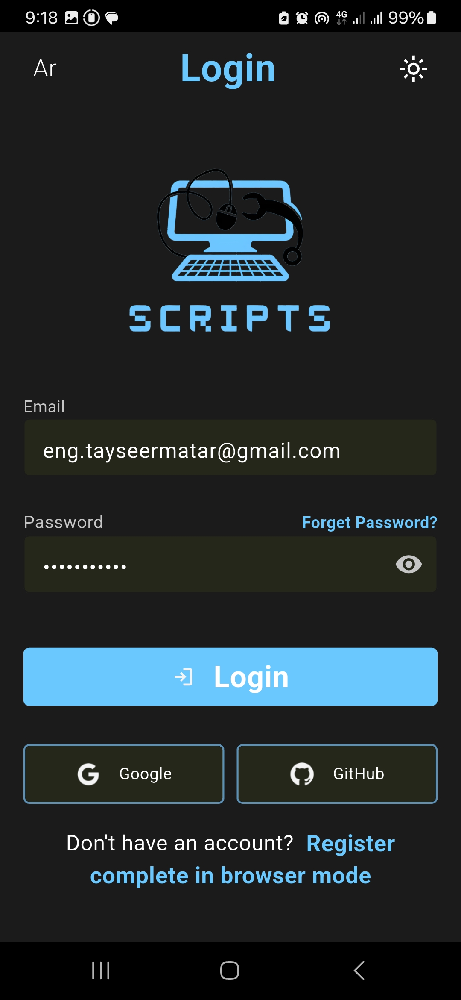
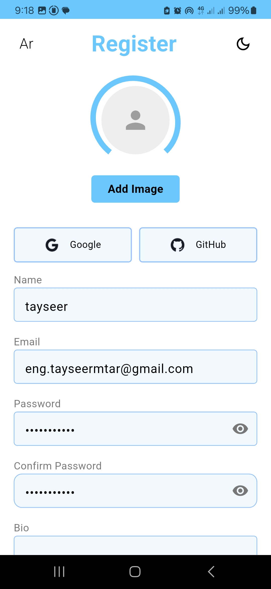

- **Students**: login with Email, Google, or GitHub  
- **Teachers**: login with Email, Google, or GitHub  
- **Teacher Registration**: dedicated signup flow for instructors  

### 💻 Courses

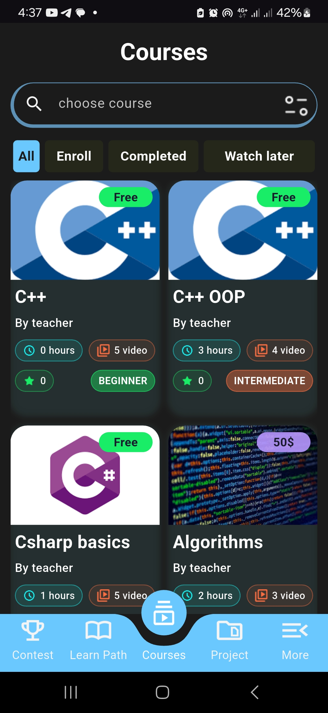
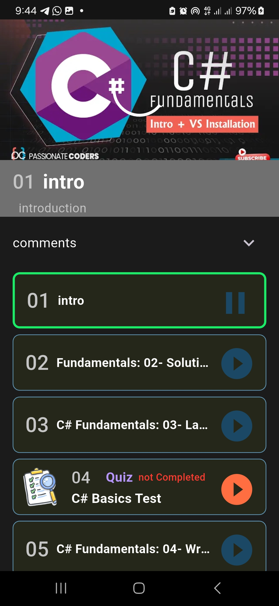
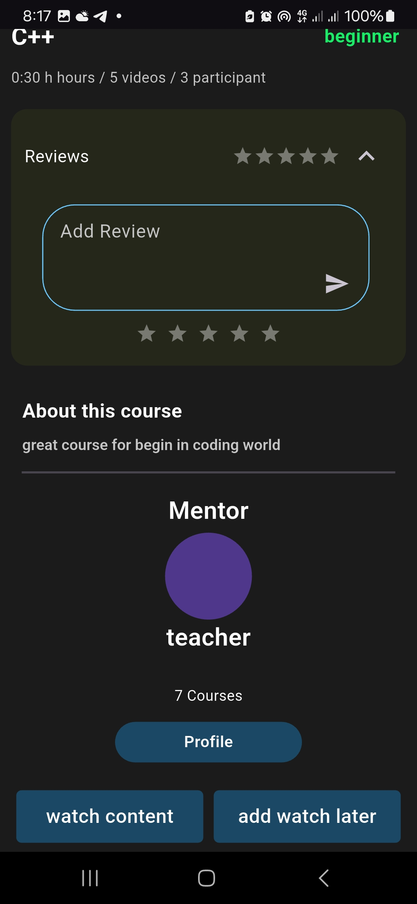

- Free and paid programming courses  
- Course states: **Enrolled**, **Watch Later**, **Completed**  
- Each course contains:  
  - Video lectures  
  - Interactive tests & quizzes  
- Certificates on completion  
- Track progress  

### 🛠️ Learning Paths

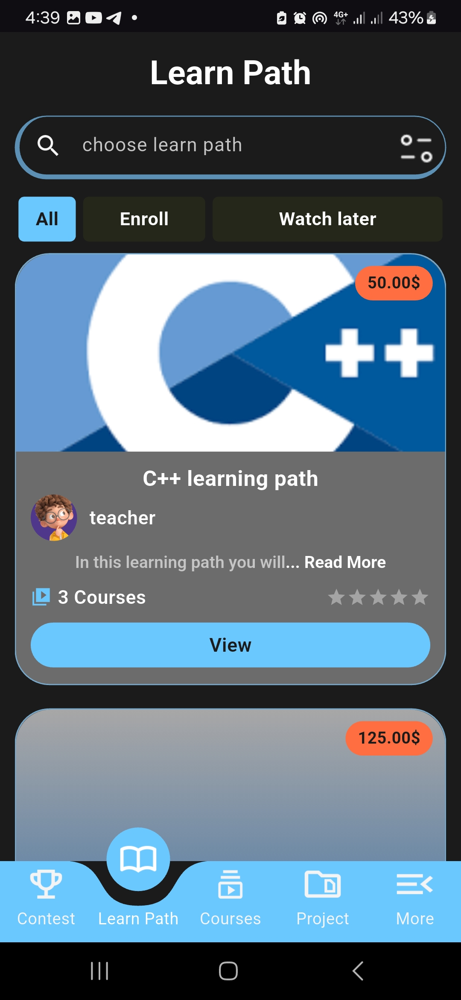
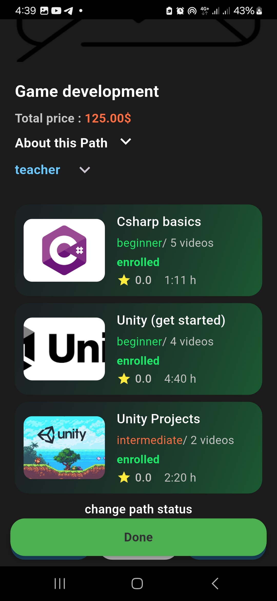

- Organized bundles of courses  
- States: **Watch Later**, **Enrolled**  

### 🏆 Contests

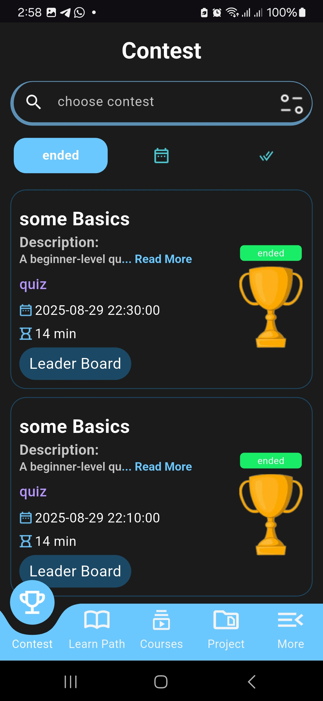
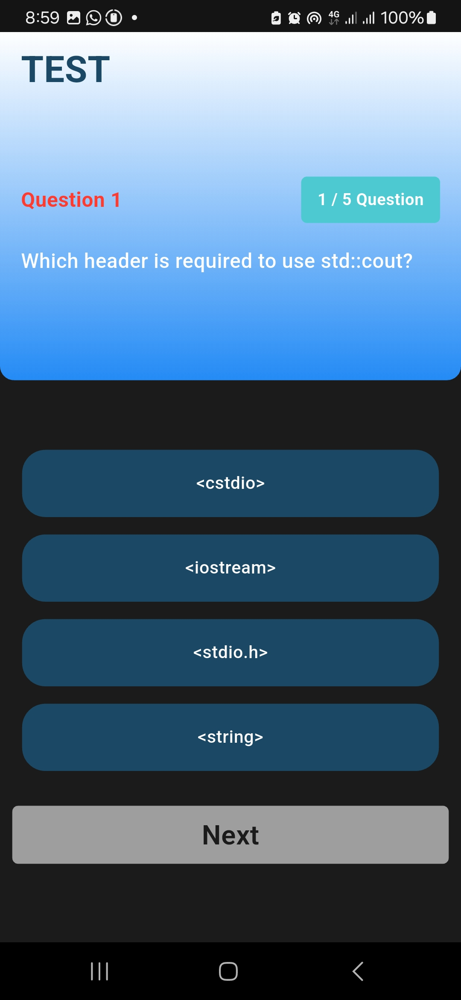

- Competitive quizzes between users  
- Contest states: **Upcoming**, **Active**, **Ended**  
- Real-time **leaderboard** to rank participants  

### 🚀 Projects

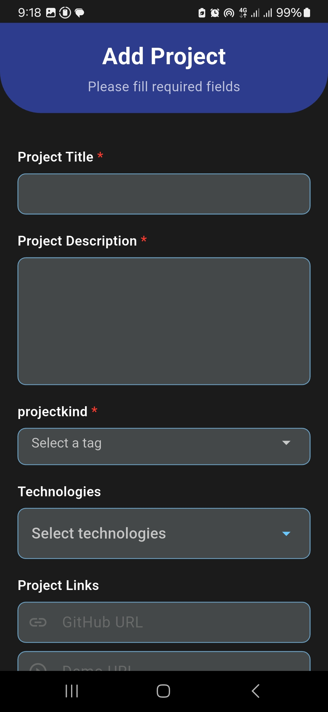
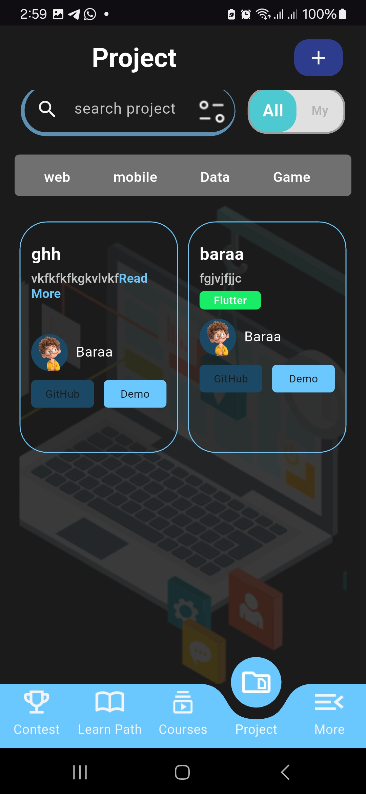

- Showcase programming projects added by users  
- Projects are **imported from GitHub** with description & demo link  
- Users can **submit their own projects** directly to the platform  

### ⚙️ More Page
- **Profile** (achievements, certificates, activity history)  

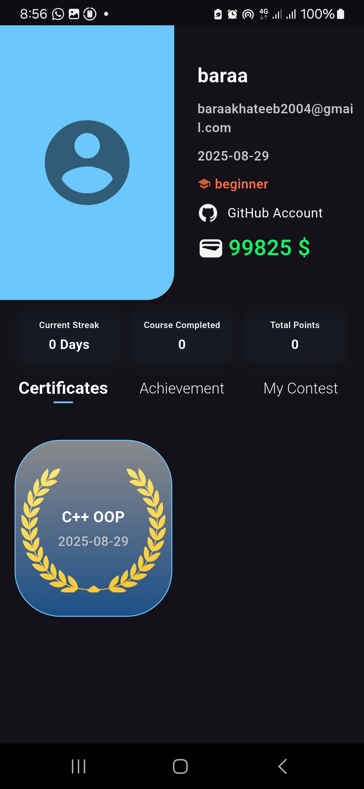
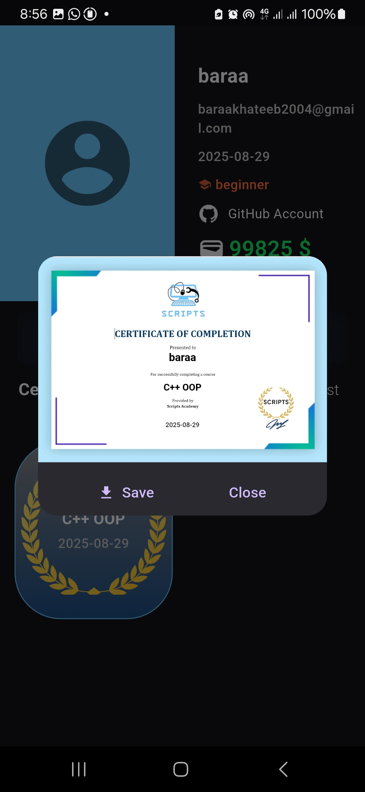

- **Settings** (themes, language, notifications, edite profile, charge wallet using stripe )  

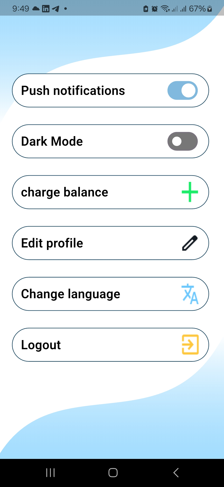
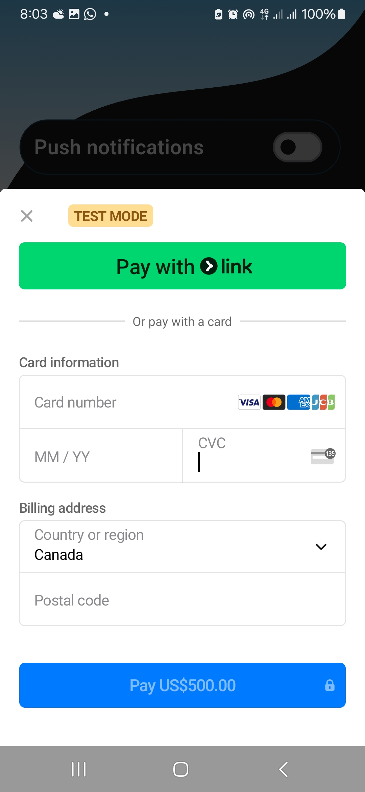

- **Change password**  

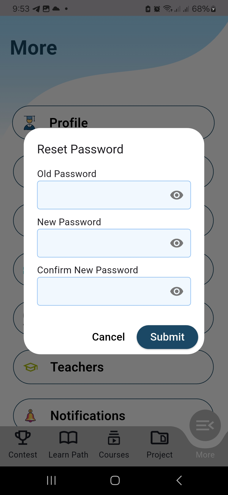

- **Participants & Teachers** – explore all users on the platform  

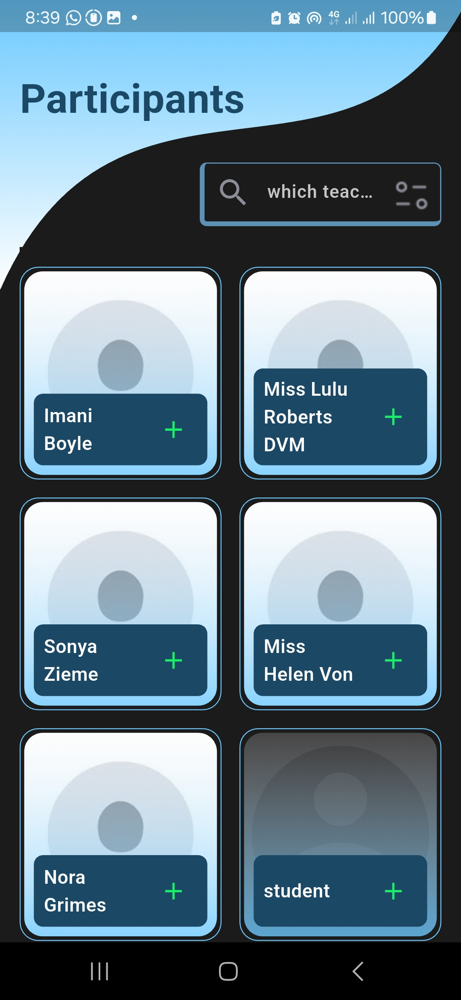
 
- **Friends** – add and manage friends  

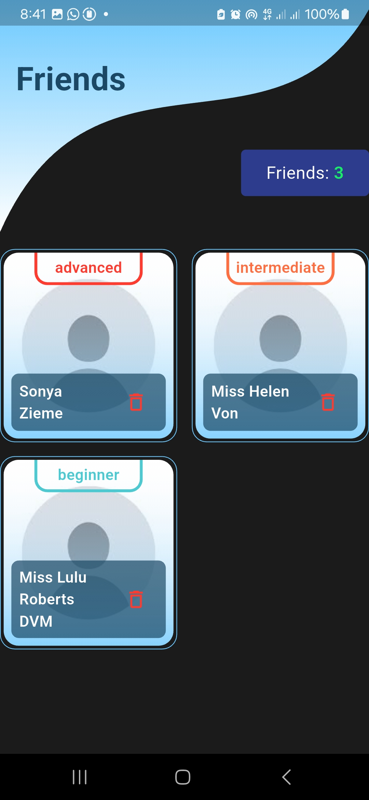

- **Notifications** – stay updated with activities & contests 

- **🤖 SCRIPTS AI** – platform-specific smart assistant for guidance

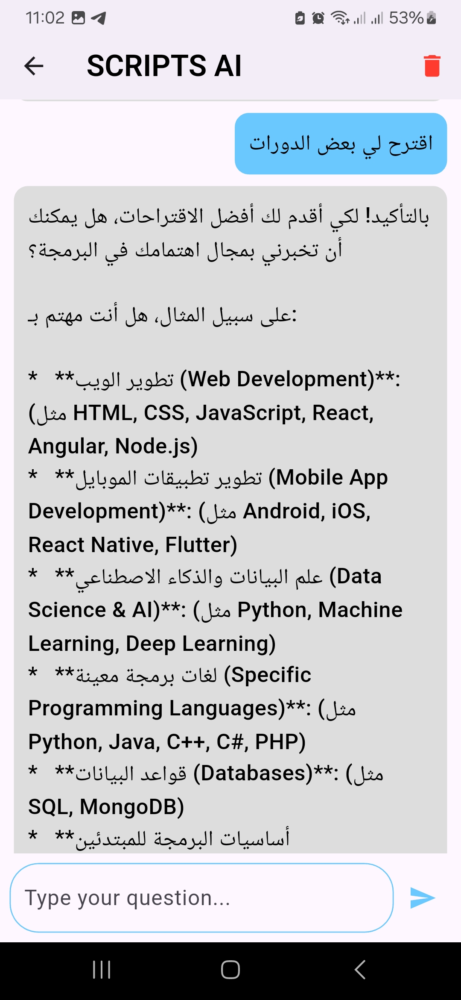

---

## 🤖 Extra Features
- **specific AI Agent** – answers only related to courses, contests, and platform content  
- **🔔 Push Notifications** – reminders for courses, contests, and new content  

---

## 🏗️ Flutter Project Architecture
The **Flutter app** follows a modular and scalable architecture.
